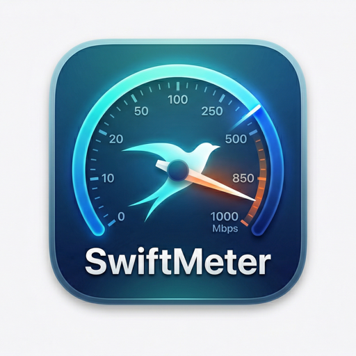

<p align="center">
  
</p>

<h1 align="center">SwiftMeter</h1>

<p align="center">
  A lightweight macOS menu bar app that shows live network upload &amp; download speeds with a rich popover — Wi-Fi details, public IP, ISP info, latency, and session statistics.
</p>

<p align="center">
  
  
  
  
  
</p>

---

## What it looks like

```
Menu bar (always visible):
  ↑ 12.4 MBps
  ↓ 48.7 MBps
```

Click the status bar item to open the full popover:

| Section | Shows |
|---|---|
| Speed Header | Live DL/UL with animated values |
| Graph | 60-second DL/UL sparkline (separate channels) |
| Connection | Interface, type, latency (TCP RTT) |
| IP Addresses | IPv4, IPv6 (local), Public WAN, ISP, Location |
| Wi-Fi | SSID, signal %, dBm, channel, band, TX rate |
| Network Config | Gateway, subnet mask, DNS servers |
| Session Stats | Downloaded/Uploaded totals, packets, errors, session age |

---

## Features

- **Live menu bar icon** — stacked two-line `↑ upload` / `↓ download` with coloured arrows (blue/green)
- **Auto-scaling units** — B/s → KBps → MBps → GBps (1024-base)
- **60-second sparklines** — separate DL and UL charts, never overlapping
- **Wi-Fi SSID** — shown after granting Location permission (required by macOS 14+)
- **Public IP + ISP + location** — fetched from `ipinfo.io`, auto-refreshed on reconnect
- **Latency** — TCP connect RTT to `1.1.1.1:443`, colour-coded (green / yellow / orange / red)
- **Session persistence** — accumulated bytes survive restarts via `UserDefaults`
- **Auto-start at login** — installs a `LaunchAgent` automatically
- **Dark & Light mode** — glass-card UI with full adaptive colours
- **No Xcode required** — single `bash build.sh` command

---

## Requirements

- macOS 14 Sonoma or later
- Xcode Command Line Tools

```bash
xcode-select --install
```

---

## Changelog

### v1.1.0
- **Battery** — major efficiency pass:
  - Replaced 1 s `NSTimer` on the main run loop with a `DispatchSourceTimer` on a utility queue
  - Heavy work (Wi-Fi details, IPs, DNS / gateway, latency, graph history) throttled by popover visibility — every 5 s when open, every 30 s when hidden
  - Latency cadence: 10 s when open, 60 s when hidden
  - Removed periodic `networksetup` shell-out (was 12 sub-processes/min); now runs only when SSID is actually unknown
  - `CWWiFiClient` calls skipped entirely when not on Wi-Fi
  - Status-bar `NSImage` cached by `(up, down, isDark)` — no redraw when unrelated state changes
  - Speed strings only re-published when actually changed
  - Removed perpetual `.symbolEffect(.pulse, .repeating)` and the per-tick chart animation + Catmull-Rom interpolation
  - Speed history publishing paused while popover is hidden (no off-screen SwiftUI churn)
  - Session save cadence relaxed 10 s → 30 s
- **Session "Since" formatter** — now shows `Xd Yh Zm` once you cross 24 hours (was capped at hours)
- **App icon** — redesigned: dark instrument-panel squircle with the same green/blue sparklines you see inside the app

### v1.0.1
- **Status bar icon** — fixed: now shows both ↑ upload and ↓ download with values; stable icon width across all speed ranges
- **Text colour** — reads the menu bar's own colour scheme (adapts to dark wallpapers / desktop tinting)
- **IPv6 collection** — more robust `getnameinfo` call; scope IDs stripped before prefix check
- **CWWiFiClient** — replaced deprecated `interface()` with `interfaces()?.first` (macOS 14+)

### v1.0.0
- Initial release

---

## Install from DMG (easiest — no terminal needed)

1. Download **[SwiftMeter-1.0.0.dmg](https://github.com/gpsurya/SwiftMeter/releases/latest)** from Releases
2. Open the DMG → drag **SwiftMeter** into **Applications**
3. Launch SwiftMeter from Applications
4. Click **Allow** on the location dialog → Wi-Fi network name appears instantly

---

## Build from source

```bash
# Clone
git clone https://github.com/gpsurya/SwiftMeter.git
cd SwiftMeter

# Build + sign + install LaunchAgent (auto-start at login)
bash build.sh

# Launch
open build/SwiftMeter.app
```

### Package a DMG yourself

```bash
bash package.sh
# → creates SwiftMeter-1.0.0.dmg in the project folder
```

---

## Wi-Fi SSID note

macOS 14+ hides the Wi-Fi network name (SSID) from all APIs unless **Location Services** is granted.  
On first launch SwiftMeter will show a system dialog:

> *"SwiftMeter wants to use your location"*

Click **Allow** — the SSID appears immediately. No GPS data is collected or transmitted; Location access is used solely to unlock the CoreWLAN SSID API.

---

## Troubleshooting

| Problem | Fix |
|---|---|
| Wi-Fi Network shows `--` | System Settings → Privacy & Security → Location Services → enable SwiftMeter |
| App won't open ("unidentified developer") | Right-click the app → Open → Open anyway |
| Status bar icon not visible | System Settings → Control Centre → Menu Bar Only items |
| Speed shows `0 B/s` on first tick | Normal — needs two readings to calculate delta; updates within 1 second |
| Public IP stuck on "Fetching…" | Check internet; click the ↺ button next to Public WAN |

---

## Uninstall

```bash
killall SwiftMeter 2>/dev/null
launchctl unload ~/Library/LaunchAgents/com.swiftmeter.app.plist
rm ~/Library/LaunchAgents/com.swiftmeter.app.plist
```

---

## Project structure

```
SwiftMeter/
├── build.sh                      # Compile + sign + install LaunchAgent
├── package.sh                    # Build a distributable DMG
├── icon.png                      # App icon (512×512 PNG)
├── SwiftMeter/
│   ├── NetPulseApp.swift         # @main, MenuBarExtra, StatusBarIcon generator
│   ├── NetworkMonitor.swift      # All data collection (speeds, WiFi, IP, latency)
│   ├── PopoverView.swift         # Popover UI — glass cards, all sections
│   ├── SpeedGraphView.swift      # Sparkline chart + signal-strength bars
│   ├── AppIcon.icns              # macOS icon bundle (16 → 1024@2x)
│   └── Info.plist                # Bundle metadata + permission strings
└── SwiftMeter.xcodeproj          # Optional Xcode project
```

---

## How it works

| Component | Implementation |
|---|---|
| Speed | `getifaddrs()` byte counters; delta/elapsed per second; 32-bit wrap-safe |
| Wi-Fi SSID | `SCDynamicStore` → `CWWiFiClient` → `networksetup` subprocess → CoreLocation |
| Latency | `NWConnection` TCP connect to `1.1.1.1:443` ≈ 1 RTT |
| Public IP | Single `ipinfo.io/json` call — ip, city, region, country, org (ISP) |
| Session | `UserDefaults` Double accumulators; saved every 10 s and on quit |
| Auto-start | `~/Library/LaunchAgents/com.swiftmeter.app.plist` with `RunAtLoad=true` |
| Status bar | `NSImage` + `NSString.draw(at:)` with precise font-metric baselines |

---

## Contributing

Pull requests are welcome! For major changes please open an issue first.

1. Fork the repo
2. Create a feature branch: `git checkout -b feature/my-feature`
3. Commit your changes: `git commit -m 'Add my feature'`
4. Push: `git push origin feature/my-feature`
5. Open a Pull Request

---

## License

MIT © 2026 [gpsurya](https://github.com/gpsurya)

Permission is hereby granted, free of charge, to any person obtaining a copy of this software and associated documentation files (the "Software"), to deal in the Software without restriction, including without limitation the rights to use, copy, modify, merge, publish, distribute, sublicense, and/or sell copies of the Software, and to permit persons to whom the Software is furnished to do so, subject to the following conditions: The above copyright notice and this permission notice shall be included in all copies or substantial portions of the Software.

THE SOFTWARE IS PROVIDED "AS IS", WITHOUT WARRANTY OF ANY KIND, EXPRESS OR IMPLIED, INCLUDING BUT NOT LIMITED TO THE WARRANTIES OF MERCHANTABILITY, FITNESS FOR A PARTICULAR PURPOSE AND NONINFRINGEMENT. IN NO EVENT SHALL THE AUTHORS OR COPYRIGHT HOLDERS BE LIABLE FOR ANY CLAIM, DAMAGES OR OTHER LIABILITY, WHETHER IN AN ACTION OF CONTRACT, TORT OR OTHERWISE, ARISING FROM, OUT OF OR IN CONNECTION WITH THE SOFTWARE OR THE USE OR OTHER DEALINGS IN THE SOFTWARE.
